# ITSM权限说明

## 项目

### 项目权限

1. 创建项目

   功能：用于项目的新建

   应用场景：

   * 在项目列表上新建

   
   
   * 在项目管理页面新建

   
   
2. 项目查看

   功能：用于查看项目下的详情

   应用场景：

   * 在拥有项目查看权限的项目下，可以查看该项目下的内容

   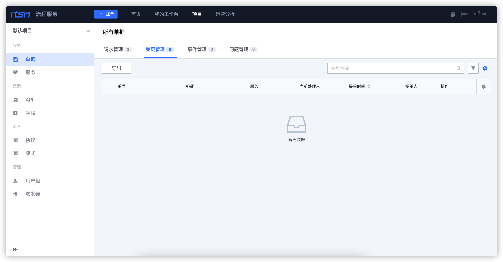
   
   说明：

   * 如果没有任何项目的查看权限，进入项目页面则只会显示无权限提示页面

   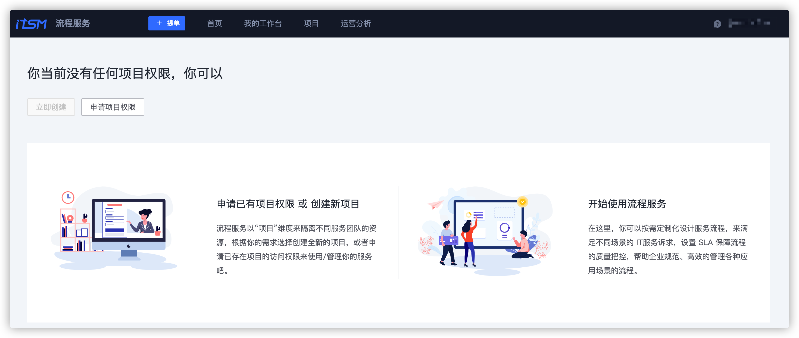
   
   * 可在项目列表查看自己拥有哪些项目的查看权限

   
   
3. 项目编辑

   功能：用于编辑项目的内容

   应用场景：

   * 在项目管理页面对目标项目进行编辑

   
   
### 服务权限

1. 服务创建

   功能：用于创建服务

   应用场景：

   * 在服务页面对应目录下新建服务

   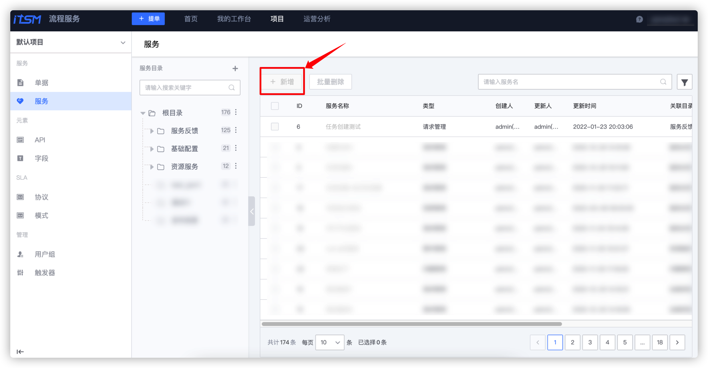
   
2. 服务管理

   功能：用于对某个服务资源进行编辑，克隆，删除等操作

   应用场景：

   * 在服务列表上选择服务实例对其进行操作

   
   
3. 工单查看

   功能：用于查看某个服务资源下的工单

   应用场景：

   * 可以查看有单据查看权限的服务所提单产生的单据

   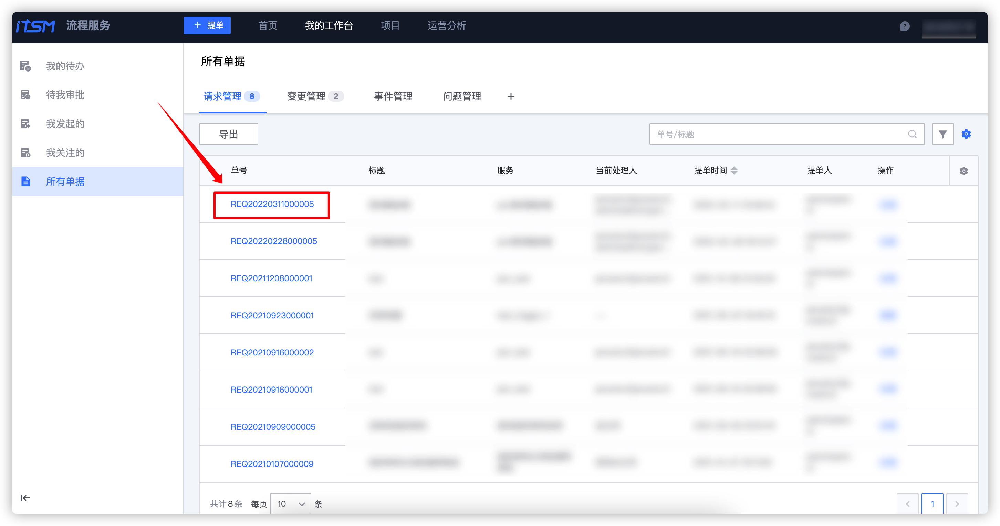
   
4. 目录新建

   功能：用于对应项目中的目录创建操作

   应用场景：

   * 在拥有目录新建权限的项目中，对应目录下新建目录

   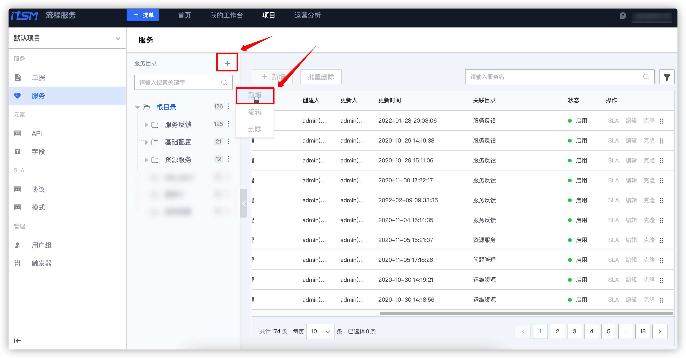
   
5. 目录编辑

   功能：用于对应项目中的目录编辑操作

   应用场景：

   * 在拥有目录新建权限的项目中，对目录进行编辑操作

   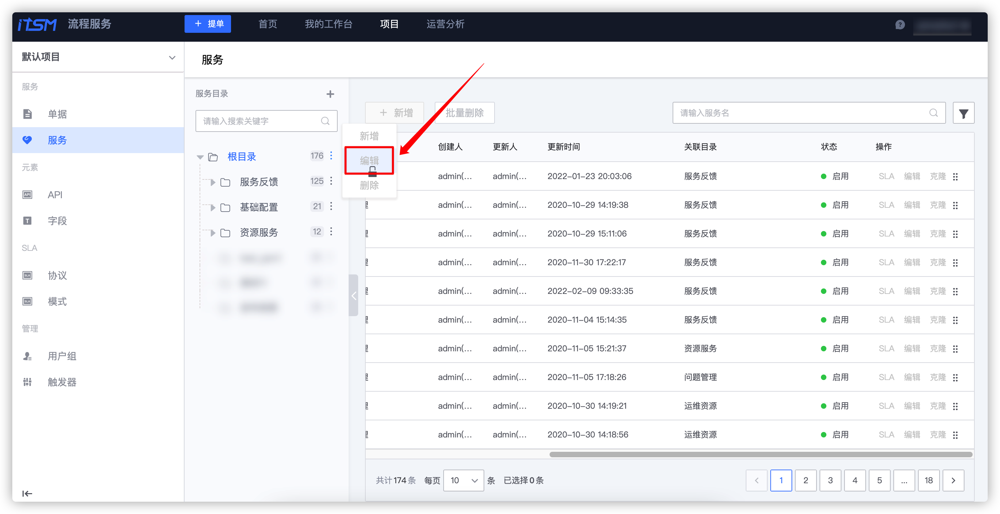
   
6. 目录删除

   功能：用于对应项目中的目录删除操作

   应用场景：

   * 在拥有目录新建权限的项目中，对目录进行删除

   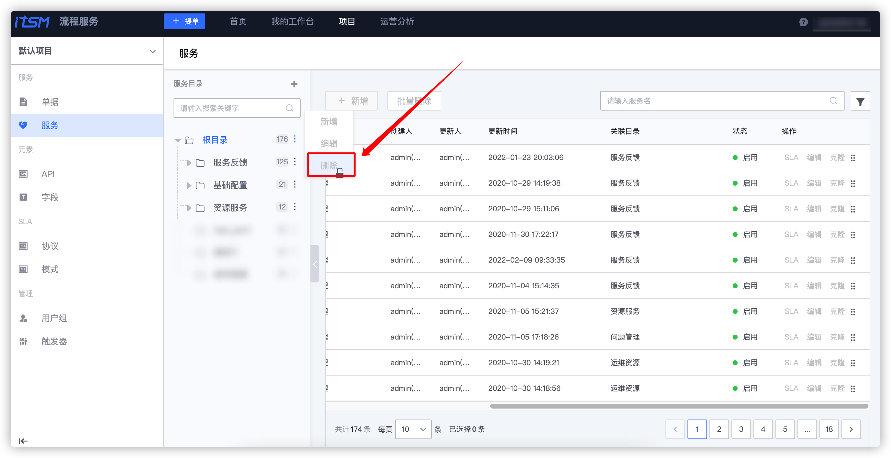
   
### 元素权限

1. 字段新建

   功能：在对应项目下新建字段

   应用场景：

   * 在拥有该权限的项目下，在字段页面新建字段

   
   
2. 字段编辑

   功能：对指定字段资源进行编辑

   应用场景：

   * 对拥有该权限的字段资源进行编辑

   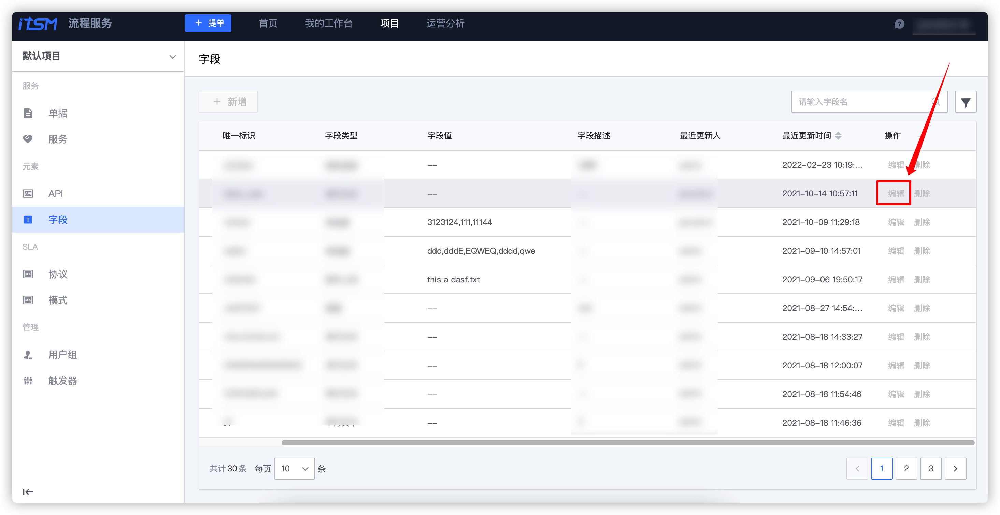
   
3. 字段删除

   功能：对指定字段资源进行删除

   应用场景：

   * 删除拥有该权限的字段资源

   
   
### 管理权限

1. 用户组新建

   功能：在对应项目下新建用户组

   应用场景：

   * 在拥有该权限的项目下，在用户组页面新建用户组

   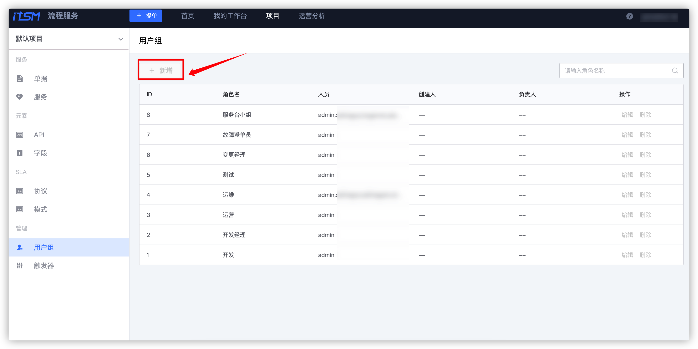
   
2. 用户组编辑

   功能：对指定用户组资源进行编辑

   应用场景：

   * 对拥有该权限的用户组资源进行编辑

   
   
3. 用户组删除

   功能：对指定用户组资源进行删除

   应用场景：

   * 删除拥有该权限的用户组资源

   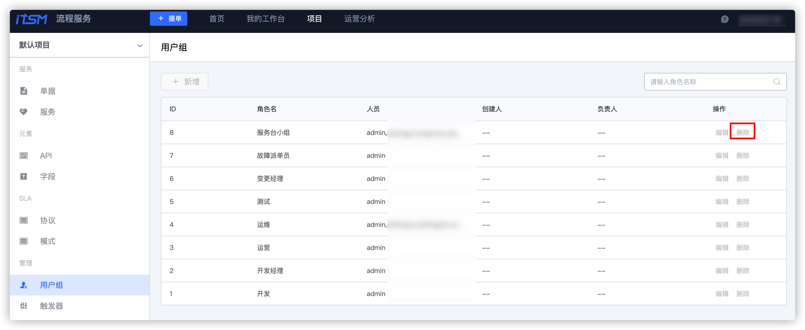
   
4. 触发器新建

   功能：在对应项目下新建触发器

   应用场景：

   * 在拥有该权限的项目下，在触发器页面新建触发器

   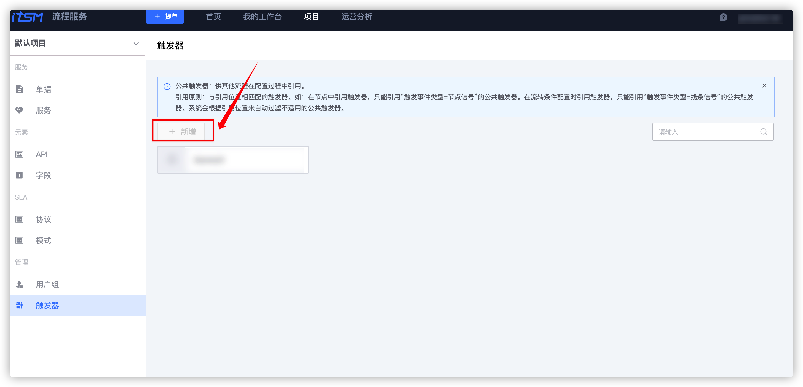
   
5. 触发器管理

   功能：对指定用户组资源进行管理

   应用场景：

   * 对拥有该权限的触发器资源进行编辑或删除

   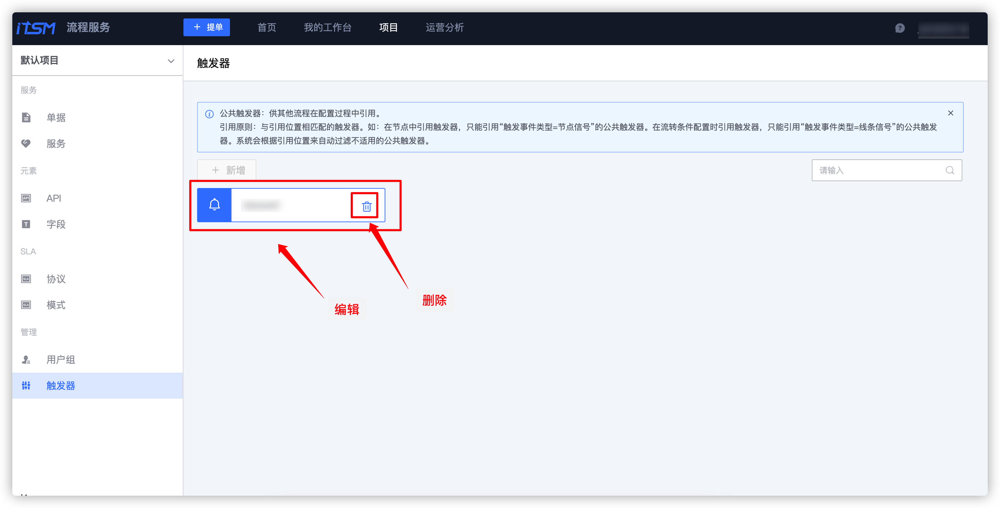
   
6. 单据状态管理

   功能：对指定服务类型下的单据状态进行管理

   应用场景：

   * 在平台管理—单据状态中对指定服务类型的单据状态进行编辑

   
   
### SLA权限

1. SLA服务模式新建

   功能：在项目下新建SLA模式

   应用场景：

   * 在拥有该权限的项目下新建SLA模式

   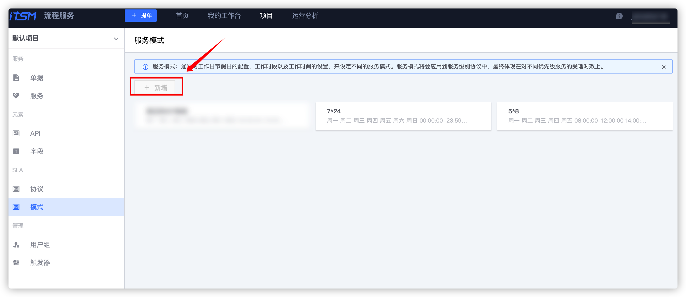
   
2. SLA服务模式编辑

   功能：对SLA服务模式资源进行编辑

   应用场景：

   * 对拥有该权限的SLA服务模式资源进行编辑

   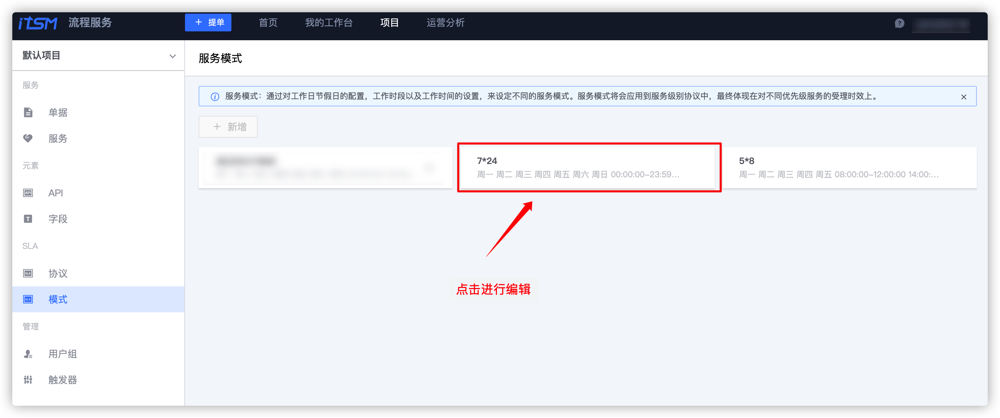
   
3. SLA服务模式删除

   功能：删除对应SLA服务模式资源

   应用场景：

   * 对拥有该权限的SLA服务模式进行删除

   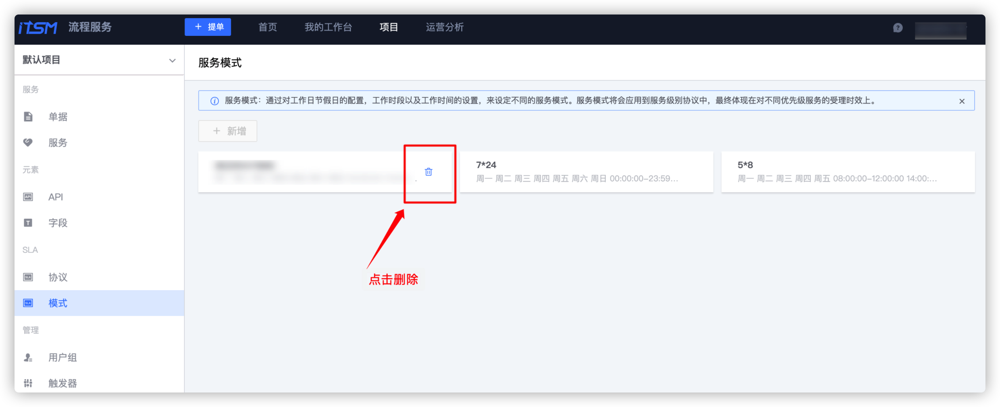
   
   说明：内置SLA服务模型不可删除 

4. SLA服务协议新建

   功能：在项目下新建SLA协议

   应用场景：

   * 在拥有该权限的项目下新建SLA协议

   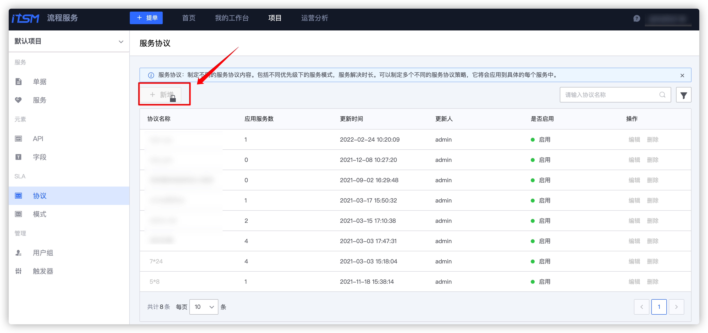
   
5. SLA服务协议编辑

   功能：对SLA服务协议资源进行编辑

   应用场景：

   * 对拥有该权限的SLA服务协议资源进行编辑

   
   
6. SLA服务协议删除

   功能：删除对应SLA服务协议资源

   应用场景：

   * 对拥有该权限的SLA服务协议进行删除

   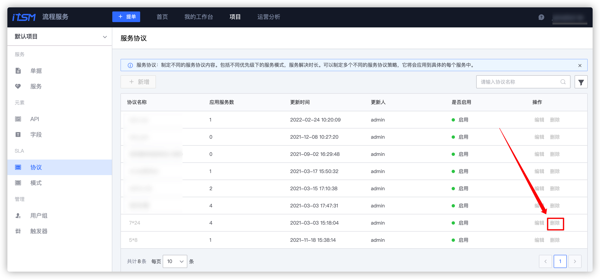
   
7. SLA优先级管理

   功能：对SLA优先级进行编辑

   应用场景：

   * 在平台管理—优先级页面对SLA优先级进行编辑

   
   
## 平台

### 公共字段权限

1. 公共字段新建

   功能：创建全局公共字段

   应用场景：

   * 在平台管理—公共字段页面创建公共字段

   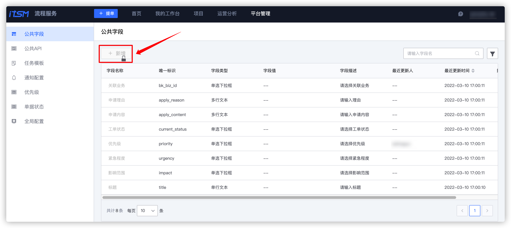
   
2. 公共字段查看+公共字段编辑

   功能：对公共字段资源进行编辑

   应用场景：

   * 对拥有权限的公共字段资源进行编辑

   
   
3. 公共字段查看+公共字段删除

   功能：对公共字段资源进行删除

   应用场景：

   * 对拥有权限的公共字段资源进行删除

   
   
### 公共API权限

1. 公共API新建

   功能：新建全局公共API

   应用场景：

   * 在平台管理—公共API页面新建公共API资源

   
   
2. 公共API查看+公共API管理

   功能：对公共API资源进行管理

   应用场景：

   * 对拥有该权限的公共API资源进行管理

   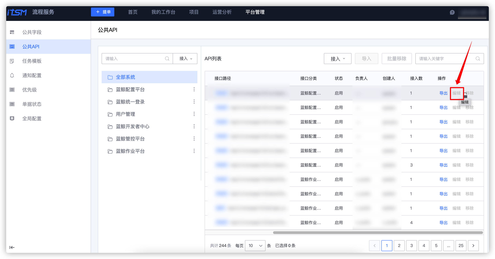
   
### 全局设置权限

1. 全局设置管理

   功能：用于对全局配置进行编辑

   应用场景：

   * 在平台管理—全局配置页面对全局配置进行编辑

   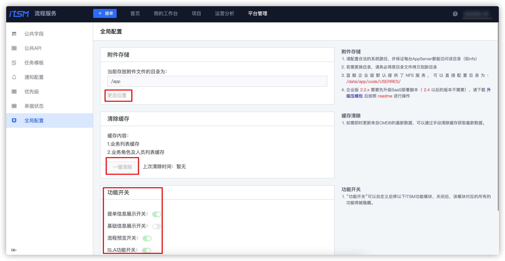
   
### 任务模版权限

1. 任务模版新建

   功能：用于新建全局任务模版

   应用场景：

   * 在平台管理—任务模版页面新建任务模版资源

   
   
2. 任务模版查看

   功能：查看任务模版的详细内容

   应用场景：

   * 查看拥有该权限的任务模版资源的详细信息

   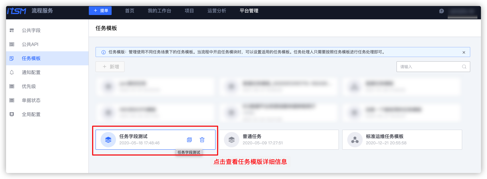
   
3. 任务模版管理

   功能：编辑任务模版的内容

   应用场景：

   * 对拥有该权限的任务模版资源进行编辑

   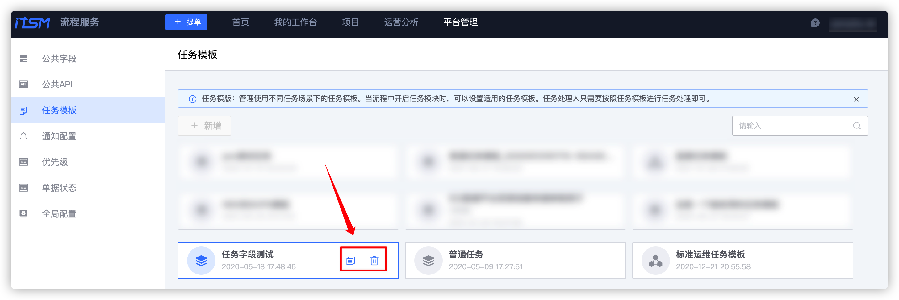
   
## 其他

1. 运营数据查看

   功能：查看运营数据

   应用场景：

   * 查看运营数据的详细内容

   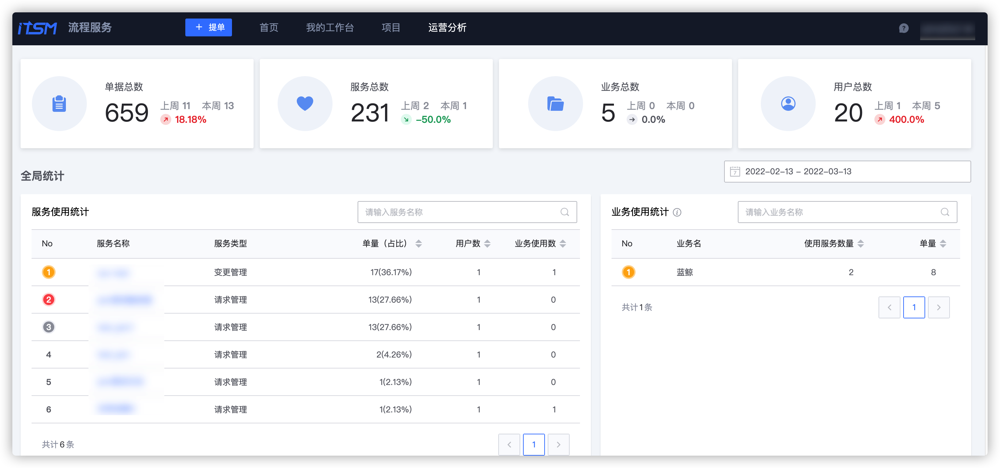
   
2. 平台管理访问

   功能：访问平台管理模块

   应用场景：

   * 进入平台管理页面，可对全局资源进行管理

   
   
   说明：

   * 当用户没有平台管理权限时，在导航栏上没有直接进入平台管理页面的入口

   
   
   

